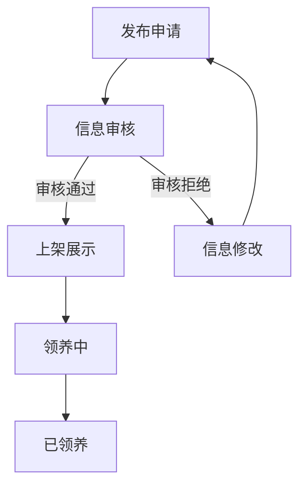
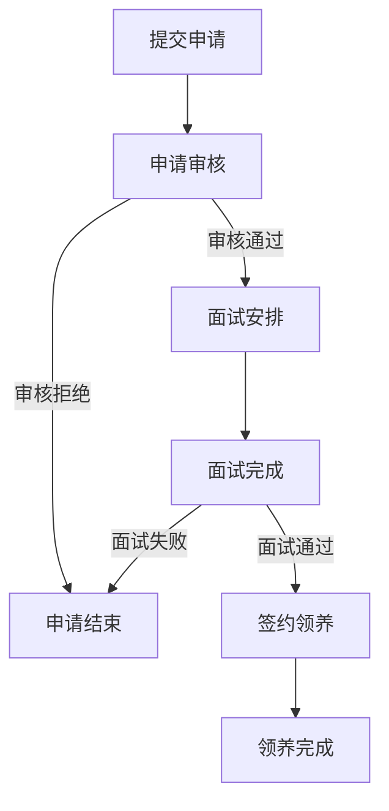
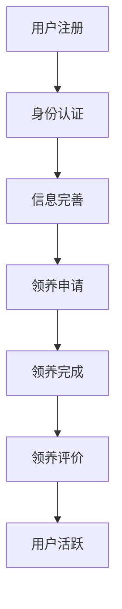

# 宠物领养系统业务文档

## 1. 业务流程分析

### 1.1 宠物领养业务流程关键环节

#### 1.1.1 宠物发布流程

**流程环节**：
1. **发布申请**：救助机构或管理员提交宠物信息
2. **信息审核**：管理员审核宠物信息的真实性和完整性
3. **上架展示**：审核通过后，宠物信息在前台展示
4. **领养中**：宠物被用户申请领养，处于待审核状态
5. **已领养**：领养申请审核通过，宠物状态更新为已领养

**输入**：
- 宠物基本信息（名称、类型、品种、年龄、性别等）
- 宠物健康信息（健康状况、疫苗情况、绝育情况等）
- 宠物图片和视频
- 领养要求和注意事项

**输出**：
- 宠物信息审核结果
- 宠物状态更新
- 宠物信息展示

**关键节点**：
- 信息审核：确保宠物信息的真实性和完整性
- 状态更新：确保宠物状态的及时更新

#### 1.1.2 领养申请流程

**流程环节**：
1. **提交申请**：用户浏览宠物信息，提交领养申请
2. **申请审核**：管理员或救助机构审核领养申请
3. **面试安排**：审核通过后，安排领养面试
4. **面试完成**：进行领养面试，评估领养条件
5. **签约领养**：面试通过后，签订领养协议
6. **领养完成**：完成领养手续，宠物状态更新为已领养

**输入**：
- 领养申请人信息（姓名、联系方式、居住情况等）
- 养宠经验和养宠计划
- 个人情况（工作、家庭、经济状况等）
- 申请理由和承诺

**输出**：
- 领养申请审核结果
- 面试安排信息
- 领养协议
- 领养状态更新

**关键节点**：
- 申请审核：评估申请人的领养条件
- 面试评估：确保领养人具备养宠能力
- 签约领养：明确领养责任和义务

#### 1.1.3 用户管理流程

**流程环节**：
1. **用户注册**：用户提交注册信息
2. **身份认证**：验证用户身份信息
3. **信息完善**：用户完善个人信息
4. **领养申请**：用户提交领养申请
5. **领养完成**：完成领养手续
6. **领养评价**：用户对领养过程进行评价

**输入**：
- 用户注册信息（用户名、密码、邮箱等）
- 个人身份信息（真实姓名、身份证等）
- 领养申请信息
- 领养评价信息

**输出**：
- 用户账户
- 身份认证结果
- 个人信息更新
- 领养申请状态
- 领养评价记录

**关键节点**：
- 身份认证：确保用户身份的真实性
- 信息完善：确保用户信息的完整性
- 领养评价：收集用户反馈，改进服务

### 1.2 业务流程图

#### 1.2.1 宠物发布流程

#### 1.2.2 领养申请流程

#### 1.2.3 用户管理流程

## 2. 状态机设计

### 2.1 宠物状态机

| 状态 | 描述 | 可转换状态 | 触发事件 |
|------|------|------------|----------|
| 待审核 | 宠物信息已提交，等待审核 | 待领养、拒绝 | 审核通过、审核拒绝 |
| 待领养 | 宠物信息已审核通过，等待领养 | 领养中、下架 | 提交领养申请、管理员下架 |
| 领养中 | 宠物已被申请领养，等待审核 | 已领养、待领养 | 领养审核通过、领养审核拒绝 |
| 已领养 | 宠物已被成功领养 | - | - |
| 下架 | 宠物信息已下架 | - | 管理员下架 |

### 2.2 领养申请状态机

| 状态 | 描述 | 可转换状态 | 触发事件 |
|------|------|------------|----------|
| 待审核 | 领养申请已提交，等待审核 | 审核中、拒绝 | 开始审核、审核拒绝 |
| 审核中 | 领养申请正在审核中 | 面试安排、拒绝 | 审核通过、审核拒绝 |
| 面试安排 | 审核通过，安排面试 | 面试完成、取消 | 面试时间确定、取消面试 |
| 面试完成 | 面试已完成 | 签约中、拒绝 | 面试通过、面试失败 |
| 签约中 | 面试通过，准备签约 | 已领养、拒绝 | 签约完成、签约失败 |
| 已领养 | 领养手续已完成 | - | - |
| 拒绝 | 领养申请被拒绝 | - | - |
| 取消 | 领养申请被取消 | - | - |

## 3. 业务流程优化点

### 3.1 流程瓶颈分析

#### 3.1.1 宠物发布流程瓶颈
- **信息审核效率**：人工审核效率低，导致宠物信息上架时间长
- **信息完整性**：宠物信息填写不完整，导致审核反复
- **图片上传**：缺少多图片上传功能，影响信息展示效果

#### 3.1.2 领养申请流程瓶颈
- **表单复杂度**：申请表单过于简单，无法全面评估领养条件
- **审核流程**：审核流程不透明，申请人无法了解审核进度
- **面试安排**：面试安排沟通成本高，效率低

#### 3.1.3 用户管理流程瓶颈
- **身份认证**：缺少实名认证流程，无法确保用户身份真实性
- **信息管理**：用户信息管理功能简单，无法满足个性化需求
- **消息通知**：缺少消息通知功能，用户无法及时了解申请状态

### 3.2 优化建议

#### 3.2.1 宠物发布流程优化
- **自动化审核**：实现部分信息的自动化审核，提高审核效率
- **表单验证**：添加表单验证，确保信息完整性
- **多图片上传**：实现多图片上传功能，支持拖拽上传和图片预览
- **视频上传**：添加视频上传功能，更全面展示宠物情况

#### 3.2.2 领养申请流程优化
- **多步骤表单**：设计多步骤申请表单，全面收集领养信息
- **状态追踪**：实现申请状态追踪功能，让申请人了解审核进度
- **在线面试**：支持在线视频面试，提高面试效率
- **电子签约**：实现电子签约功能，简化签约流程

#### 3.2.3 用户管理流程优化
- **实名认证**：实现实名认证流程，确保用户身份真实性
- **信息管理**：完善个人信息管理功能，支持头像上传和地址管理
- **消息通知**：添加消息通知功能，及时通知用户申请状态变化
- **积分系统**：设计积分系统，鼓励用户参与和贡献

### 3.3 优化预期效果

| 优化点 | 预期效果 | 衡量指标 |
|--------|----------|----------|
| 自动化审核 | 审核时间减少50% | 平均审核时间 |
| 多步骤表单 | 申请信息完整率提高80% | 表单完整率 |
| 状态追踪 | 用户满意度提高60% | 用户满意度调查 |
| 消息通知 | 沟通成本减少70% | 沟通次数 |
| 实名认证 | 信息真实性提高90% | 信息验证通过率 |

## 4. 业务规则设计

### 4.1 宠物发布规则
- **信息完整性**：宠物信息必须包含基本信息、健康信息和领养要求
- **审核标准**：宠物信息必须真实、完整、符合平台要求
- **发布权限**：只有管理员和救助机构可以发布宠物信息
- **状态管理**：宠物状态必须及时更新，确保信息准确性

### 4.2 领养申请规则
- **申请资格**：用户必须完成实名认证才能提交领养申请
- **申请限制**：每个用户同时最多可以提交3个领养申请
- **审核标准**：根据申请人的养宠经验、经济状况、居住条件等综合评估
- **面试要求**：领养申请审核通过后，必须进行面试

### 4.3 用户管理规则
- **注册要求**：用户注册必须提供真实有效的邮箱和手机号
- **身份认证**：用户必须完成实名认证才能享受完整功能
- **信用管理**：建立用户信用评分系统，影响领养申请优先级
- **行为规范**：用户必须遵守平台规则，不得发布虚假信息

## 5. 总结

通过对宠物领养业务流程的分析，我们识别了关键环节、状态流转和优化点。优化后的业务流程将更加高效、透明和用户友好，能够更好地服务于宠物领养业务需求。

主要优化方向包括：
1. **流程自动化**：减少人工干预，提高流程效率
2. **信息完整性**：确保宠物和申请人信息的完整性
3. **用户体验**：提供清晰的状态追踪和消息通知
4. **安全合规**：加强身份认证和信息验证

这些优化措施将有助于提高宠物领养的成功率，减少流程瓶颈，提升用户满意度，从而推动宠物领养事业的健康发展。

---

**文档版本**：v1.0
**最后更新**：2026-03-14
**负责人**：全栈开发团队